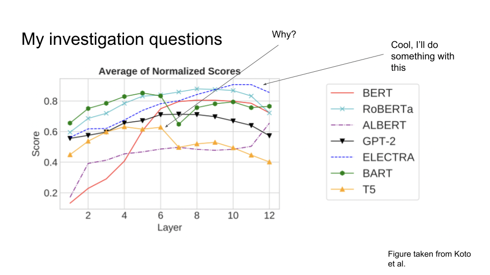

# Update:
Please see my investigation report [https://github.com/hotzjacobb/cpsc532g/blob/main/cpsc532g_final_proj_final.pdf](https://github.com/hotzjacobb/cpsc532g/blob/main/cpsc532g_final_proj_final.pdf)

# Original outline:
Below is my proposal for my course project. When completed, I will update this README with results and hopefully conclusions (:

# A further examination into *Discourse Probing of Pretrained Language Models* (Koto et al.) and *ELECTRA: Pre-training Text Encoders as Discriminators Rather Than Generators* (Clark et al.)

#### (Overview and plans)

The Koto et al. paper looks at a variety of LM’s and tests them on a variety of discourse related tasks, such as sentence ordering, RST tasks, and Cloze Story questions. The two important results from this paper for me were:

- T5 surprisingly doing significantly worse than BART, as I would expect T5 to do similarly as it had a very similar training regimen to BART, a similar parameter count (110M vs. 121M), and similar structure.
- ELECTRA does extremely well, especially so when considering that it saw less data than most models in pre-training.

_____________________________________

For my project, I want to try to understand why T5 does not do as well as BART, which is a surprising result not explained in the paper. I will begin this by acquainting myself with what the models’ parameters look like before any finetuning (Koto et al. use a constant learning rate for all models, thus a simple suspicion is that pre-trained rates have different magnitudes. This would be convenient, but of course the actual reason is probably not this simple). I will look at the code for training the model (I have read the papers but I will read them very closely to better understand possible divergences). 

There’s a fair chance that I have no great insight once having done the above, so at that point I think emailing the authors asking about their insight/efforts to explain this and maybe looking if there are any other papers that answer similar questions would be good. For all experiments, as far as I understand, the datasets are all published with the repo, except for the Penn Treebank which I’ve gotten through the UBC Library. I’ve not worked with the treebank before, and I’m not sure how much time I will have to spend on using an off-the-shelf parser to load in that data.
_____________________________________

In addition, I also want to work with ELECTRA (Clark et al.), given its interesting pre-training and results. Almost all other LM’s are trained as language generators; they fill in a masked token or span in the training data. ELECTRA is a discriminator. It, by contrast, takes an existing LM, (let’s say BERT for example), and has that LM fill in some masked tokens. ELECTRA’s task is then to, for each word, determine if the word was the original word or if it is a generated word from the other generator LM. In the case the the generator LM’s prediction is the same as the gold label, then that word is considered original from ELECTRA’s discriminatory perspective.

First, as an achievable goal, I will integrate ELECTRA with a downstream technique seen in class such as content planning/discourse relations and examine results on abstractive summarization. I hope that this will produce good results, considering how well ELECTRA seems to do with discourse related tasks. I also want to examine ELECTRA’s pre-training and see if I can try something different. Given that I do not have Google/Stanford levels of compute, I will train ELECTRA-Small with alterations and compare it to itself, and maybe other small baselines.

#### (Timeline)

Given that work with ELECTRA involves non-trivial compute, and that work on reproduction/investigation of Koto et al. to explain T5’s results also may involve serious compute, I will work on both in parallel initially. If one path is more promising than the other, then there is a chance that I may just pursue that, but I would really like to bring both to some level of completion.

**Week 1 (Nov 7-11):**
Parse Penn Treebank
Setup for reproduction of Koto et al.’s experiments (on a smaller scale)
Look at T5 vs. BART
Decide on what to incorporate with ELECTRA (some summarization technique probably such as content planning)
Attempt pre-training small ELECTRA

**Week 2 (Nov 14-18):**
Implement ELECTRA + other method and measure performance
Reproduce Koto et al.’s experiments on a smaller scale
Contact authors of Koto et al. for insight on T5 vs. BART after my prelim. efforts
Read and look for explanations of divergence of similarly trained models
Pre-train small ELECTRA

**Week 3 (Nov 21-25):**
Continue to implement ELECTRA + other method and measure performance
Decide on change to ELECTRA pre-training
If not finished, continue investigating T5 vs. BART (time permitting try more time consuming experiments like training small versions from scratch and seeing if results hold for small models with same data)

**Week 4 (Nov 28-Dec 2):**
Continue to implement ELECTRA + other method and measure performance
Work on ELECTRA pre-training
If not finished, continue investigating T5 vs. BART

**Week 5 (Nov 5-9):**
Work on write up of investigation
Do any additional needed testing

**Week 6 (Nov 12-16):**
Finish write-up

#### (References w/ descriptions)

Koto, F. et al. 2021. Discourse probing of pretrained language models. Proceedings of the 2021 Conference of the North American Chapter of the Association for Computational Linguistics: Human Language Technologies (Stroudsburg, PA, USA, 2021).
Comment: Original discourse probing paper with results that inspire this investigation

Clark, K. et al. 2020. ELECTRA: Pre-training Text Encoders as Discriminators Rather Than Generators. ICLR 2020 (Mar. 2020).
Comment: Paper introducing ELECTRA and its pre-training

Raffel, C. 2020. Exploring the Limits of Transfer Learning with a Unified Text-to-Text Transformer. (Jul. 2020).
Comment: Paper introducing T5 and its pre-training

Lewis, M. et al. 2020. BART: Denoising Sequence-to-Sequence Pre-training for Natural Language Generation, Translation, and Comprehension. Proceedings of the 58th Annual Meeting of the Association for Computational Linguistics (Stroudsburg, PA, USA, 2020).
Comment: Paper introducing BART and its pre-training

Marcus, M. et al. 1993. Building a Large Annotated Corpus of English: The Penn Treebank. (Apr. 1993).
Comment: RST dataset

Additional notes: I haven’t yet decided what paper describing training for a downstream task such as summarization to use with ELECTRA and report results on, but I expect it will likely be content planning. My investigation will also cite more datasets as seen in Koto et al.

